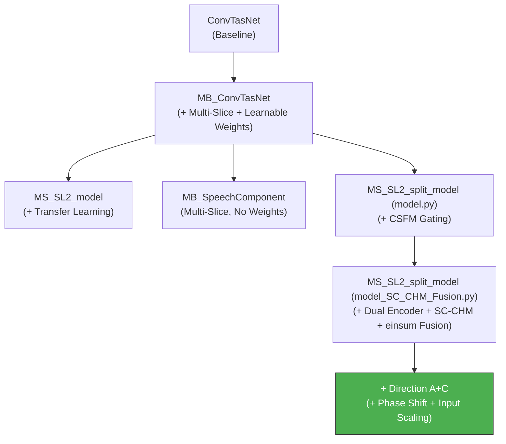

# Denoiser-Main Project: Comprehensive Understanding

> [!NOTE]
> This document serves as a persistent reference for all future conversations about the `d:\denoiser-main` project.
> Last updated: 2026-05-20

---

## 1. Project Overview

This project implements a **speech separation / speech denoising** system based on the **Conv-TasNet** (Convolutional Time-domain Audio Separation Network) architecture. The core idea is to separate a mixture of audio signals (e.g., speech + noise, or two speakers) into individual source signals directly in the time domain, without requiring a spectrogram (time-frequency) representation.

The project is a **research codebase** that iterates on the original Conv-TasNet design, introducing several novel modifications:

1. **Multi-Slice (MS) architecture** — running multiple parallel TCN "slices" (branches) over the same input, each producing skip connections that are weighted and fused.
2. **Channel-wise weighting / fusion (CWM)** — using learnable scalar weights (via `einsum`) to combine outputs from different slices.
3. **Shuffled-Convolution + Channel Harmonization Module (SC-CHM)** — replacing the standard depthwise convolution block with a dual-path block that uses channel shuffling and gated fusion (tanh/sigmoid).
4. **Dual-path Encoder** — combining a 1D convolutional encoder and an STFT-based encoder, concatenating their outputs.
5. **Adaptive Controller (Direction A+C)** — input-dependent Phase Shift (Gumbel-Softmax) and Input Scaling (Sigmoid) for slice-weight fusion.

---

## 2. File Structure

| File | Purpose |
|---|---|
| [model_SC_CHM_Fusion.py](file:///d:/denoiser-main/model_SC_CHM_Fusion.py) | **Primary model** — The novel SC-CHM Fusion architecture with dual-path encoder, channel shuffle, gated cross-harmonization, and Direction A+C adaptive fusion (Gumbel-Softmax + Input Scaling). |
| [model.py](file:///d:/denoiser-main/model.py) | **Legacy/reference models** — Contains multiple model variants: `ConvTasNet`, `MB_ConvTasNet`, `MS_SL2_model`, `MB_SpeechComponent`, `MS_SL2_split_model`. |
| [trainer.py](file:///d:/denoiser-main/trainer.py) | Training loop, loss computation (SI-SNR with PIT), checkpointing, LR scheduling, τ annealing. |
| [trainnew_blue.py](file:///d:/denoiser-main/trainnew_blue.py) | **Training entry point** — CLI argument parsing, model instantiation, data loader creation, and training invocation. |
| [conf.py](file:///d:/denoiser-main/conf.py) | Hyperparameters configuration (network architecture, data paths, optimizer settings, trainer settings). |
| [dataset.py](file:///d:/denoiser-main/dataset.py) | Data loading: reads Kaldi-style `.scp` files, splits utterances into chunks, creates batches. |
| [audio.py](file:///d:/denoiser-main/audio.py) | Audio I/O: WAV reading/writing using `scipy.io.wavfile`, Kaldi `.scp` parsing, `WaveReader` class. |
| [utils.py](file:///d:/denoiser-main/utils.py) | Utility functions: logger setup, JSON dump/load. |
| [train_blue.sh](file:///d:/denoiser-main/train_blue.sh) | Shell script to launch training with specific arguments. |
| [1144851/](file:///d:/denoiser-main/1144851/) | Contains diagrams (drawio, PNG) and documentation (Student.docx/pdf, UML guidelines). |

### Documentation Files (`md/`)

| File | Purpose |
|---|---|
| [project_understanding.md](file:///d:/denoiser-main/md/project_understanding.md) | This document — comprehensive project reference. |
| [direction_a_plan.md](file:///d:/denoiser-main/md/direction_a_plan.md) | Implementation plan for Direction A (Input Scaling). |
| [direction_c_phase_shift_plan.md](file:///d:/denoiser-main/md/direction_c_phase_shift_plan.md) | Implementation plan for Direction C (Phase Shift via Gumbel-Softmax). |
| [direction_AC_plan.md](file:///d:/denoiser-main/md/direction_AC_plan.md) | Combined A+C plan — the actually implemented approach. |

---

## 3. Architecture Details

### 3.1 General Conv-TasNet Pipeline

All model variants follow this high-level pipeline:

```
Input Waveform (B, S)
    │
    ▼
┌─────────┐
│ Encoder │  ── 1D Conv or Dual-path (1D Conv + STFT)
└────┬────┘
     │  (B, N, T)
     ▼
┌──────────────────┐
│ LayerNorm (cLN)  │
└────────┬─────────┘
         │  (B, N, T)
         ▼
┌──────────────────┐
│ 1×1 Conv (proj)  │  ── Bottleneck: N → B channels
└────────┬─────────┘
         │  (B, B_ch, T)
         ▼
┌──────────────────────────────┐
│ TCN Separation Network       │  ── Slices × Repeats × Conv1DBlocks
│ (with skip connections)      │
└────────┬─────────────────────┘
         │  (B, Sc, T)
         ▼
┌──────────────────┐
│ PReLU            │
└────────┬─────────┘
         │
         ▼
┌──────────────────┐
│ Mask Conv 1×1    │  ── Sc → num_spks × N
└────────┬─────────┘
         │
         ▼
┌──────────────────┐
│ Non-linear       │  ── sigmoid / softmax / relu
│ (mask generation)│
└────────┬─────────┘
         │  num_spks × (B, N, T)
         ▼
┌──────────────────┐
│ Apply Mask       │  ── element-wise multiply with encoder output
└────────┬─────────┘
         │
         ▼
┌──────────────────┐
│ Decoder (1D      │  ── ConvTranspose1d
│ Transposed Conv) │
└────────┬─────────┘
         │  num_spks × (B, S')
         ▼
   Separated Waveforms
```

### 3.2 Model Variants in `model.py` (Legacy)

| Model | Lines | Key Feature |
|-------|-------|-------------|
| `ConvTasNet` | 293-453 | **Baseline.** Standard Conv-TasNet. Encoder: 1D Conv + ReLU. `R` repeats × `X` blocks. |
| `MB_ConvTasNet` | 456-637 | **Multi-Branch.** `Slice` parallel TCN branches, each weighted by learnable scalar `wList[s]`. |
| `MS_SL2_model` | 640-797 | **Transfer Learning.** Loads pre-trained `MB_ConvTasNet`, fixed weights `[0.501, 0.499]`. |
| `MB_SpeechComponent` | 806-989 | Like `MB_ConvTasNet` but **without** learnable weights — skip connections simply summed. |
| `MS_SL2_split_model` | 993-1198 | **CSFM gating:** `sigmoid(wList[i] * relu(skip * wList[i]))`. Fixed 4 weights. |

### 3.3 The SC-CHM Fusion Model (`model_SC_CHM_Fusion.py`) — Active

This is the **primary/active model** used for training (imported by `trainnew_blue.py`).

#### 3.3.1 Dual-Path Encoder (Lines 509-538)

```python
# Path 1: 1D Convolutional Encoder
w = self.encoder_1d(x)          # (B, N=512, T)
w = w[:, :256, :]               # Take first 256 channels → (B, 256, T)

# Path 2: STFT Encoder
out = th.stft(x, n_fft=512, hop_length=8, win_length=64, return_complex=True,
              window=th.hann_window(64, device=x.device))
out = out.real                  # Take real part
out = out[:, :256, :-2]         # (B, 256, T)  — trim to match temporal dim

# Concatenate
w = th.cat((w, out), 1)         # (B, 512, T)
```

> [!IMPORTANT]
> Unlike the baseline Conv-TasNet (which uses `F.relu` on the encoder output), the SC-CHM Fusion model does **NOT** apply ReLU to the encoder output. The 1D conv output is used directly (first 256 channels), and the STFT real part provides the other 256 channels.

#### 3.3.2 Conv1DBlock with SC-CHM (Lines 137-249)

This is the key architectural innovation. Each block has **two parallel paths** after the initial `1×1 Conv → PReLU → Norm`:

```
Input y (B, B_ch, T)
    │
    ▼
1×1 Conv: B_ch → H (conv_channels=512)
    │
    ▼
PReLU → LayerNorm
    │
    ├──────────────────────────────┐
    │                              │
    ▼                              ▼
Channel Shuffle                 Depthwise Conv
    │                              │
    ▼                              ▼
Shuffled Group Conv            1×1 Conv (H → 256)
(H → 256, groups=groups)          │
    │                              ├─── sigmoid ──┐
    ├─── tanh ──────┐              │              │
    │               │              ├─── tanh ─────┤
    ├─── sigmoid ───┤              │              │
    │               │              │              │
    ▼               ▼              ▼              ▼
  shufftan      shuffsigm      deptan         depsigm
    │               │              │              │
    ▼               ▼              ▼              ▼
 _x_up = shufftan * depsigm    _x_down = shuffsigm * deptan
    │                              │
    └──────────┬───────────────────┘
               │ Concatenate
               ▼
         (B, 512, T)
               │
               ▼
         PReLU → LayerNorm
               │
         ┌─────┴─────┐
         │            │
    sconv (1×1)   skip_out (1×1)
    → B_ch          → Sc
         │            │
    residual       skip connection
    x = x + out
```

**Channel Shuffle** operation ([channel_shuffleforsound](file:///d:/denoiser-main/model_SC_CHM_Fusion.py#L305-L330)):
- Reshapes `(B, C, T)` → `(B, C/groups, groups, T)` → transpose dims 1,2 → reshape back.
- This interleaves channels across groups, enabling cross-group information flow.

**Gated Cross-Harmonization (CHM)**:
- Both paths produce `tanh` and `sigmoid` activations.
- Cross-multiplication: `shuffled_tanh × depthwise_sigmoid` and `shuffled_sigmoid × depthwise_tanh`.
- This creates a gating mechanism that combines information from both the shuffled-convolution and depthwise-convolution paths.

#### 3.3.3 Direction A+C: Adaptive Fusion (Lines 455-643)

This is the **currently implemented fusion strategy**, replacing the original `einsum` approach. It consists of two cooperating mechanisms:

| Mechanism | Branch | Output | Purpose |
|-----------|--------|--------|---------|
| **Direction A — Input Scaling** | `skip_connection.mean(dim=-1) → fc_scale(256→4) → Sigmoid` | `α (B, K)` ∈ (0,1) | Per-weight retention ratio — decides "how strong" each weight is |
| **Direction C — Phase Shift** | `skip_connection.mean(dim=-1) → fc_shift(256→4) → Gumbel-Softmax` | `δ (B, K)` soft one-hot | Per-batch shift index — decides "which weight goes to which slice" |

**Combined formula for each slice `s`:**
```
w_eff(s) = Σ_{d=0}^{K-1}  δ_d · α_{(s+d)%K} · w_{(s+d)%K}
output += w_eff(s) · h⁽ˢ⁾
```

**Implementation in `forward()` (Lines 562-625):**

> [!IMPORTANT]
> Both Direction A and Direction C use the **same input**: `skip_connection.mean(dim=-1)` (pooled skip-connection of the current slice, 256-dim). There is no separate `AdaptiveController` class — the logic is implemented inline in `forward()`.

```python
for Slice in range(self.slice):
    # ... TCN blocks accumulate skip_connection ...

    # Direction A: skip-connection pooling → FC → Sigmoid
    c_skip = skip_connection.mean(dim=-1)              # (B, Sc=256) AvgPool over time
    alpha = th.sigmoid(self.fc_scale(c_skip))          # (B, 4)  — fc_scale: Linear(256, 4)

    # Direction C: same pooling → FC → Gumbel-Softmax
    delta = F.gumbel_softmax(self.fc_shift(c_skip),
                              tau=self.tau, hard=not self.training, dim=-1)  # (B, 4) — fc_shift: Linear(256, 4)

    # A+C fusion: cyclic shift + scaling
    indices = [(Slice + d) % K for d in range(K)]
    shifted_w = self.wList[indices]                     # (K,)
    shifted_alpha = alpha[:, indices]                   # (B, K)
    scaled_shifted = shifted_alpha * shifted_w          # (B, K)
    w_eff = (delta * scaled_shifted).sum(dim=-1)        # (B,)
    weighted_skip = skip_connection * w_eff.unsqueeze(-1).unsqueeze(-1)
    Slices_Output = Slices_Output + weighted_skip
```

> [!IMPORTANT]
> **Key behavior differences from original:**
> - **Original:** All slices get the same scalar `Σwᵢ` — no input-dependence, no per-slice differentiation.
> - **Direction A+C:** Each slice gets a different `w_eff(s)` that depends on (1) the input audio (via `α` and `δ`), and (2) the slice index (via cyclic indexing).

#### 3.3.4 Default Hyperparameters

| Parameter | Symbol | Default Value | Description |
|-----------|--------|---------------|-------------|
| `L` | L | 16 | Encoder filter length (samples), stride = L//2 = 8 |
| `N` | N | 512 | Number of encoder filters (dual-path: 256 conv + 256 STFT) |
| `X` | X | 8 | Conv1D blocks per repeat |
| `R` | R | 2 | Number of repeats |
| `B` | B | 256 | Bottleneck channels |
| `Sc` | Sc | 256 | Skip-connection channels |
| `Slice` | — | 2 | Number of parallel TCN slices |
| `H` | H | 512 | Hidden channels in Conv1D blocks |
| `P` | P | 3 | Kernel size in Conv1D blocks |
| `norm` | — | "gLN" | Normalization type |
| `num_spks` | — | 2 | Number of output sources |
| `non_linear` | — | "sigmoid" | Mask activation function |

---

## 4. Gumbel-Softmax and Annealing Analysis

### 4.1 Why Gumbel-Softmax is Used

The Phase Shift mechanism (Direction C) needs to select a **discrete shift index** Δ ∈ {0, 1, 2, 3} that determines which base weight `w_k` is assigned to which slice. Since discrete selection (`argmax`) is non-differentiable, the project uses **Gumbel-Softmax** as a differentiable relaxation.

```python
# In model_SC_CHM_Fusion.py, Line 568:
delta = F.gumbel_softmax(self.fc_shift(c_grouped),
                          tau=self.tau, hard=not self.training, dim=-1)
```

- **Training (`self.training=True`):** `hard=False` → produces a **soft** probability vector `δ ∈ (0,1)^K`, sum to 1. Gradients flow through all K paths.
- **Inference (`self.training=False`):** `hard=True` → uses **straight-through estimator** (forward = argmax one-hot, backward = soft gradient).

### 4.2 Does This Project Need Annealing (退火)?

**Yes — and it is already implemented** in [trainer.py](file:///d:/denoiser-main/trainer.py#L255-L258):

```python
# trainer.py, Line 255-258:
if hasattr(self.nnet, 'tau'):
    self.nnet.tau = max(0.1, 1.0 - (self.cur_epoch / num_epochs) * 0.9)
    self.logger.info("Gumbel-Softmax tau = {:.3f}".format(self.nnet.tau))
```

### 4.3 Annealing Schedule

The current implementation uses **linear annealing** from τ=1.0 → τ=0.1:

| Epoch (of 50) | τ Value | Behavior |
|---------------|---------|----------|
| 1 | 0.982 | Near-uniform exploration — `δ` is spread across all K shifts |
| 10 | 0.820 | Starting to concentrate |
| 25 | 0.550 | Moderate focus on preferred shifts |
| 40 | 0.280 | Mostly deterministic |
| 50 | 0.100 | Near-hard selection — `δ ≈ one-hot` |

### 4.4 Why Annealing is Necessary for This Project

> [!IMPORTANT]
> Temperature annealing is **important** here for three reasons:

1. **Exploration → Exploitation:** At high τ, all shift indices are explored, allowing the FC layer `fc_shift` to receive gradients from all K paths and learn meaningful logits. At low τ, the network commits to the best shift, reducing noise in the fusion.

2. **Gradient quality:** Without annealing (fixed low τ), gradients become very sparse early in training, and `fc_shift` weights may get stuck. Without annealing (fixed high τ), the soft distribution never sharpens, and the Phase Shift degenerates into a uniform blend — losing the intended "discrete selection" behavior.

3. **Train/inference consistency:** At inference time, `hard=True` produces a true one-hot. If training was done with high τ (uniform), the network never learned to be confident about a single shift, causing a train-test mismatch. Annealing ensures the training distribution gradually approaches the inference distribution.

### 4.5 Alternative Annealing Strategies

| Strategy | Formula | Pros | Cons |
|----------|---------|------|------|
| **Linear (current)** | `τ = max(0.1, 1.0 - 0.9·e/E)` | Simple, predictable | May cool too fast if E is small |
| **Exponential** | `τ = max(0.1, exp(-r·e))` | More time at high τ | Need to tune decay rate `r` |
| **Cosine** | `τ = 0.1 + 0.45·(1+cos(πe/E))` | Smooth, common in LR schedules | Slightly more complex |
| **Step** | `τ = {1.0 if e<E/3, 0.5 if e<2E/3, 0.1}` | Explicit phase control | Discontinuities |

> [!TIP]
> The current linear schedule is a reasonable default. Consider switching to exponential or cosine if training is unstable in the early epochs (the network needs more exploration time).

---

## 5. Training Pipeline

### 5.1 Entry Point: `trainnew_blue.py`

```
CLI Arguments:
  --gpus          GPU IDs (default: "0,1")
  --epochs        Number of epochs (default: 50)
  --checkpoint    Directory to save models (required)
  --resume        Checkpoint to resume from
  --batch-size    Batch size (default: 16)
  --num-workers   Data loading workers (default: 4)
  --trainer_type  "origin" | "repeat" | "add_block" — controls fine-tuning strategy
```

**Fine-tuning modes (`trainer_type`):**
- `"origin"`: Train all parameters normally.
- `"repeat"`: Sets `X=8, R=2`. Freezes all parameters **except** those in repeat index `[2]=='1'` (i.e., the second repeat).
- `"add_block"`: Sets `X=9, R=1`. Freezes all except block index `[3]=='8'` (the 9th/new block).

**Transfer Learning:** The training script loads `best.pt.tar` and initializes the model with `strict=False`, allowing partial weight loading.

### 5.2 Trainer: `trainer.py`

#### Loss Functions

| Mode | Function | Description |
|------|----------|-------------|
| `"sisnr"` | `SiSnrTrainer.sisnr()` | Scale-Invariant Signal-to-Noise Ratio |
| `"snr"` | `SiSnrTrainer.snr()` | Standard Signal-to-Noise Ratio |

**SI-SNR formula:**
```
s_target = (<x_zm, s_zm> / ||s_zm||²) * s_zm
SI-SNR = 20 * log10(||s_target|| / ||x_zm - s_target||)
```

**Permutation Invariant Training (PIT):**
- For SI-SNR mode: evaluates all permutations of source assignments, picks the best.
- For SNR mode: uses fixed ordering (no permutation search).
- Final loss = `-mean(max_SI-SNR_per_utterance)` (negative because we maximize SI-SNR).

#### Training Loop Features
- **Optimizer:** Adam (lr=0.001, weight_decay=1e-5)
- **LR Scheduler:** `ReduceLROnPlateau` (factor=0.5, patience=2, min_lr=1e-8)
- **Early Stopping:** Stops after `no_impr=100` epochs without improvement.
- **Gradient Clipping:** Optional (via `clip_norm`).
- **Gumbel-Softmax τ Annealing:** Linear decay from 1.0 → 0.1 over training.
- **Mixed Precision:** Uses `torch.amp.autocast` + `GradScaler`.
- **Checkpointing:** Saves both "best" and per-epoch checkpoints.

### 5.3 Data Pipeline

#### Configuration (`conf.py`)
```python
fs = 16000           # Sample rate: 16 kHz
chunk_len = 3        # Chunk length: 3 seconds
chunk_size = 48000   # = 3 * 16000 samples
num_spks = 2         # Two-source separation
```

#### Data Format (Kaldi-style)
- **mix.scp**: Maps utterance keys to mixed audio file paths.
- **spk1.scp / spk2.scp**: Maps utterance keys to individual source file paths.

#### Loading Flow
```
.scp files → WaveReader (audio.py)
    → Dataset (dataset.py) — returns {mix, [ref1, ref2]}
    → ChunkSplitter — splits long utterances into fixed-length chunks (80000 samples)
    → DataLoader — batches and shuffles chunks
```

**ChunkSplitter behavior:**
- Utterances shorter than `least` (=chunk_size//2 = 24000 samples) are discarded.
- Utterances shorter than `chunk_size` are zero-padded.
- Longer utterances are split into overlapping chunks with stride = `least`.

---

## 6. Normalization Layers

| Type | Class | Description |
|------|-------|-------------|
| `"cLN"` | `ChannelWiseLayerNorm` | Per-channel LayerNorm. Transposes to `(N,T,C)`, applies LN, transposes back. |
| `"gLN"` | `GlobalChannelLayerNorm` | Computes mean/var across both channel and time dims `(1,2)`. Custom implementation with learnable `gamma`/`beta`. |
| `"BN"` | `nn.BatchNorm1d` | Standard batch normalization. |

---

## 7. Key Tensor Shape Tracking (SC-CHM Fusion Model)

For a batch of 4 utterances with 9999 samples each (`B=4, S=9999`):

```
Input:          (4, 9999)
After unsqueeze → Conv1D encoder:
                (4, 512, T)    where T = (9999 - 16) / 8 + 1 ≈ 1249

1D encoder path: (4, 256, 1249)  — first 256 channels
STFT path:       (4, 256, 1249)  — real part, trimmed
Concatenated:    (4, 512, 1249)

After cLN:       (4, 512, 1249)
After 1×1 proj:  (4, 256, 1249)  — bottleneck B=256

Direction A+C (both from skip_connection):
  c_skip:     (4, 256)         — skip_connection.mean(dim=-1), pooled over time
  alpha:      (4, 4)           — fc_scale(c_skip) → Sigmoid, scaling factors ∈ (0, 1)
  delta:      (4, 4)           — fc_shift(c_skip) → Gumbel-Softmax, soft one-hot shift vector

Inside Conv1DBlock:
  After 1×1:     (4, 512, 1249)  — H=512
  After PReLU+LN: (4, 512, 1249)
  Shuffled path:  (4, 256, 1249)  — groupoutchnl=256
  Depthwise path: (4, 256, 1249)
  After concat:   (4, 512, 1249)
  After PReLU+LN: (4, 512, 1249)
  Residual out:   (4, 256, 1249)  — sconv
  Skip out:       (4, 256, 1249)  — skip_out, Sc=256

Per-slice fusion:
  w_eff:          (4,)            — effective weight per batch element
  weighted_skip:  (4, 256, 1249)

After all slices: (4, 256, 1249)
After PReLU:      (4, 256, 1249)
After mask conv:  (4, 1024, 1249) — 2 * N = 1024
Chunked to 2:     2 × (4, 512, 1249)
After sigmoid:    2 × (4, 512, 1249)
Masked encoder:   2 × (4, 512, 1249)
Decoded:          2 × (4, ~9999)
```

---

## 8. Configuration Summary (Active Config in `conf.py`)

```python
nnet_conf = {
    "L": 16,           # Filter length
    "N": 512,          # Encoder filters
    "X": 8,            # Blocks per repeat
    "R": 2,            # Number of repeats
    "B": 256,          # Bottleneck channels
    "Sc": 256,         # Skip-connection channels
    "H": 512,          # Hidden channels
    "P": 3,            # Kernel size
    "norm": "gLN",     # Global Layer Norm
    "num_spks": 2,     # Two sources
    "non_linear": "sigmoid"
}

trainer_conf = {
    "optimizer": "adam",
    "optimizer_kwargs": {"lr": 0.001, "weight_decay": 1e-5},
    "min_lr": 1e-8,
    "patience": 2,
    "factor": 0.5,
    "logging_period": 200,
    "no_impr": 100,
    "loss_mode": "sisnr"
}
```

---

## 9. Model Evolution



The green node is the **currently active model** used for training.

---

## 10. Training Execution

The shell script [train_blue.sh](file:///d:/denoiser-main/train_blue.sh) shows the typical training command:

```bash
python trainnew_blue.py \
    --gpus 0 \
    --epochs 50 \
    --checkpoint //media/kaldi/SP1/MingHshuan/checkpoint/20241121_1_test \
    --batch-size 2 \
    --num-workers 0 \
    --trainer_type repeat
```

The `--trainer_type repeat` flag means:
- Only the **second repeat** (`R=1`, index `'1'`) of each slice is trained.
- All other parameters are **frozen**.
- This is a **fine-tuning** strategy.

---

## 11. Known Code Issues & Observations

> [!WARNING]
> The following issues were identified during code review.

### 11.1 Potential Bugs

1. **`model_SC_CHM_Fusion.py` Lines 528-529** — Unnecessary unsqueeze/squeeze:
   ```python
   w = th.unsqueeze(w, 2)
   w = th.squeeze(w, 2)
   ```
   These two operations cancel each other out.

2. **`conf.py` Line 30** — `"Slice"` is commented out from `nnet_conf`, so the model uses its default value. For `MS_SL2_split_model` in `model_SC_CHM_Fusion.py`, the default `Slice=2`.

3. **`audio.py` Line 40** — `np.float` is deprecated since NumPy 1.20. Should use `np.float64` or `float`.

4. **`model_SC_CHM_Fusion.py`** — Unused `self.a = nn.Conv1d(in_channels=N, out_channels=257, kernel_size=1)` is defined but never used in `forward()`.

### 11.2 Design Observations

1. **Groups calculation in Conv1DBlock**: The `groups` parameter for `shuffgroupconv` is recomputed from `dilation * (kernel_size - 1) // 2`, which means it varies per block (since dilation changes). This is intentional — it ties the shuffle group count to the receptive field.

2. **Multiple channel shuffle implementations**: The code contains `channel_shuffle`, `channel_shuffleforsound`, and `channel_shuffle2`. Only `channel_shuffleforsound` is actually used (via `ChannelShuffle.forward`). The difference is in the reshape order: `channel_shuffle` uses `(B, groups, C//groups, T)` while `channel_shuffleforsound` uses `(B, C//groups, groups, T)`.

3. **Direction A+C shared input**: Both Direction A (`fc_scale`) and Direction C (`fc_shift`) take the **same** 256-dim input: `skip_connection.mean(dim=-1)`. This is computed from each slice's accumulated skip connections (Sc=256), **not** from the encoder output `w` (512-dim). Both `fc_scale` and `fc_shift` are `nn.Linear(256, 4)` with 1,028 parameters each.

---

## 12. Diagrams Directory (`1144851/`)

Contains architectural documentation:

| File | Description |
|------|-------------|
| `DataFlow.drawio` / `DataFlow.drawio.png` | Main dataflow diagram of the architecture |
| `Dataflow_2.drawio` | Alternative/updated dataflow diagram |
| `Denoise.drawio.xml` / `Denoise.drawio.png` | Denoise system overview diagram |
| `Class.drawio` | UML class diagram |
| `Student.docx` / `Student.pdf` | Student documentation / report |
| `UML_Class_Diagram_Guidelines.pdf` | Reference material for UML class diagrams |
